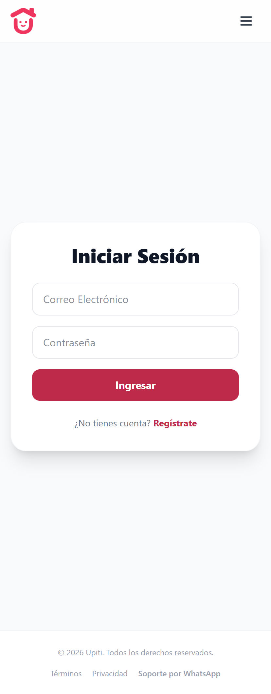

# 🛍️ Tienda Upiti

Plataforma e-commerce moderna desarrollada por Estudio Camaleón, enfocada en rendimiento, experiencia de usuario y escalabilidad.


---

## ✨ Features

* 🛒 Carrito de compras dinámico
* 🔐 Sistema de autenticación de usuarios
* 📦 Gestión de productos
* 📱 Diseño responsive (mobile-first)
* ⚡ Optimización de rendimiento

---

## 🧠 Tecnologías utilizadas

* Frontend: HTML, CSS, JavaScript / React (ajustar)
* Backend: Node.js / API (ajustar)
* Base de datos: (agregar si aplica)

---

## 🚀 Demo

👉 [https://tu-demo.vercel.app](https://tienda-upiti.vercel.app/)]

---

## 📸 Screenshots




---

## ⚙️ Instalación

```bash
git clone https://github.com/Estudio-Camaleon/tienda-upiti.git
cd tienda-upiti
npm install
npm run dev
```

---

## 📂 Estructura del proyecto

```
/src
  /components
  /pages
  /utils
/public
```

---

## 🤝 Contribuciones

Las contribuciones son bienvenidas.

1. Fork del proyecto
2. Crear una rama (`feature/nueva-feature`)
3. Commit (`feat: agregar nueva feature`)
4. Push
5. Pull Request

---

## 📄 Licencia

Este proyecto está bajo la licencia MIT.

---

## 👨‍💻 Autor

Desarrollado por Estudio Camaleón
🌐 https://www.estudiocamaleontuc.com
